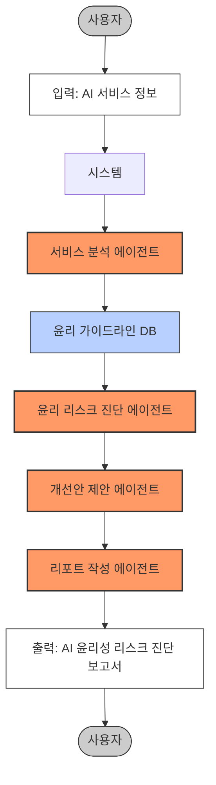

# AI 윤리성 리스크 진단 시스템

본 프로젝트는 AI 윤리성 리스크 진단 에이전트를 설계하고 구현한 실습 프로젝트입니다.

## Overview

- Objective: 특정 AI 서비스를 대상으로 윤리적 리스크(편향성, 프라이버시 침해, 투명성 부족 등)를 분석하고, 개선 권고안 작성
- Methods: RAG, 벡터 임베딩, 윤리 가이드라인 기반 평가
- Tools: 가이드라인 검색, 리스크 평가, 유사 사례 검색, 보고서 생성

## Features

- AI 서비스의 기능 및 특징 자동 분석
- EU AI Act, OECD AI 원칙 기반 윤리적 리스크 평가
- 항목별 구체적 개선 권고안 제시
- 종합적인 진단 결과 및 권고사항 보고서 생성

## Tech Stack 

| Category   | Details                      |
|------------|------------------------------|
| Framework  | LangGraph, LangChain, Python |
| LLM        | GPT-4o-mini via OpenAI API   |
| Retrieval  | FAISS, Chroma                |
| Database   | Vector DB (Chroma)           |

## Agents
 
- 서비스 분석 에이전트: AI 서비스 개요 파악 (대상 기능 정리, 주요 특징 등)
- 윤리 리스크 진단 에이전트: 편향성, 개인정보, 설명가능성 등 윤리성 항목별 리스크 평가
- 개선안 제안 에이전트: 윤리성 강화 위한 구체적 개선 방향 제안
- 리포트 작성 에이전트: 진단 결과 및 권고사항 리포트 생성

## State 
- service_info: AI 서비스 기본 정보 및 분석 결과
- ethical_guidelines: 적용된 윤리 가이드라인 정보
- risk_assessment: 항목별 윤리 리스크 평가 결과
- improvement_recommendations: 항목별 개선 권고안
- report: 최종 보고서 내용
- status: 현재 진단 진행 상태
- error: 오류 메시지

## Architecture

## Directory Structure
├── data/                     # 윤리 가이드라인 문서
│   ├── eu_ai_act.pdf         # EU AI Act 문서
│   └── oecd_principles.pdf   # OECD AI 원칙 문서
├── agents/                   # 에이전트 모듈
│   ├── service_analyzer.py   # 서비스 분석 에이전트
│   ├── risk_evaluator.py     # 윤리 리스크 진단 에이전트
│   ├── recommender.py        # 개선안 제안 에이전트
│   └── report_generator.py   # 리포트 작성 에이전트
├── tools/                    # 에이전트 도구 모듈
│   ├── guideline_search.py   # 가이드라인 검색 도구
│   ├── risk_assessment.py    # 리스크 평가 도구
│   ├── case_search.py        # 유사 사례 검색 도구
│   └── report_template.py    # 보고서 템플릿 도구
├── prompts/                  # 프롬프트 템플릿
├── vectordb/                 # 벡터 데이터베이스
├── outputs/                  # 진단 결과 저장
├── app.py                    # 실행 스크립트
└── README.md
